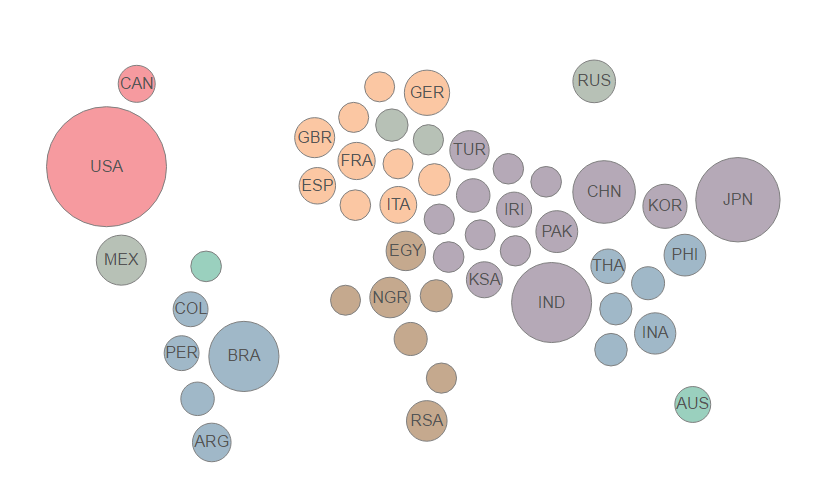

# forceMap



This is a package to create force directed maps in R.  Inspiration and code starting point credited to Aaron Bycoffe's block: http://bl.ocks.org/bycoffe/3230965.  Currently, Aaron has no license, so I've reached out to make sure I can use his code (even though it is barely the same).  I will make this a public repo when I hear from him.

The idea is to create a map-like visualization that reflects differences in numeric values.  In practice, a circle is drawn for each country in a data set with the radius proportional to some value (population, gdp, etc. are common, but use your imagination!).  Then, each circle is tethered to a point on an imaginary map based on lat/lon coordinates.  Finally, a physical simulation lets the circles rearrange themselves.  This results in imperfect placement of countries, but everything should be in the right general area.

If you are interested in a method that maintains strict geographic integrity, use choropleth maps (boring...).

## Known Issues
1. Doesn't display great in R Studio windows - adjust sizing if you want to visualize it there.  Otherwise, just use a browser.
2. Some countries not in included database, which causes errors. (looking to fix soon)

## Install
Will remove the key when I hear about license.
```{r}
require(devtools)
devtools::install_github("iankloo/forceMap", auth_token='3be765aac659fdd751d7ce49b89332b182916d0b')
```
## Use
I included some sample data so you can see what kind of data definitely works.

```{r}
library(forceMap)

df <- forceMapSample
forceMap(df)
```
Note that there are on-hover events when rendered in both R and shiny (posted here statically).  If there are any other interactive features you can think of, let me know.

## Customize
Because this is a force directed network, it is really hard to get the sizing policies working correctly.  The best way to get the sizing right is to mess around with the minRadius, maxRadius, and projScale parameters until you get something that looks right (and doesn't fly off the screen!).

It would also be fairly easy to add more parameters to allow for customization of the physics, but I'm guessing no one is interested in that level of customization.  Things work fine for me with the current options.

See the R documentation for the forceMap() function for more info about the parameters.  Or if you're lazy:

```{r}
forceMap(data, minRadius = 10, maxRadius = 40, projScale = 2000,
  width = NULL, height = NULL, elementId = NULL)
```  
## Shiny
Working with shiny is no big deal - it is just important to mess with the sizing parameters to get everything to fit where you want it.  ui.r and server.r files can be found above in the shiny folder.  Or if you're lazy:

ui.r
```{r}
library(shiny)
library(forceMap)

shinyUI(fluidPage(
  forceMapOutput('map'),
  sliderInput('proj', 'Map Projection Scale', min=300, max=3000, value=1500),
  sliderInput('minRad', 'Minimum Circle Radius', min=5, max=100, value=10),
  sliderInput('maxRad', 'Maximum Circle Radius', min=10, max=200, value=40)
  )
)
```

server.r
```{r}
df <- forceMapSample

server <- function(input, output, session) {
  
  
  output$map <- renderForceMap({
    forceMap(df, minRadius=input$minRad, maxRadius=input$maxRad, projScale=input$proj)
  })
 
}
```
